<!-- footer: <small><i>Kıvanç Tatar, Associate Professor in Interactive AI</small></i> 
 
 -->

# Machine Learning and Artificial Intelligence Applied to Computational Arts, Music, and Games

<small> These slides are live at: 
https://ktatar.github.io/2026-06-university-of-oslo</small>

---

## Acknowledgements

| Country  | Funding Body  | Timeline |
|:---|:---|:---|
| Sweden | The Wallenberg AI, Autonomous Systems, and Software Program – Humanities and Society |2025-2030 |
| Sweden | VR - Vetenskapsrådet | 2025-2031 |
| Sweden | The Wallenberg AI, Autonomous Systems, and Software Program – Humanities and Society |2021-2026 |
| Canada | Canada Council for the Arts | 2018-2021 |
| Canada |BC Arts Council | 2020 |
| Switzerland | Swiss National Science Foundation | 2020-2021|
| Canada |Social Sciences and Humanities Research Council| 2014-2020 |
| Canada |Natural Sciences and Engineering Research Council| 2014- 2019 |

---

## Research Themes

- Deep Learning and Audio
- Multimodal Deep Learning for Movement and Audio
- AI in Computational Creativity and Game Design
- Societal Impact of AI in Culture, Arts, and Music
- Artworks

---

## Research Themes

- **Deep Learning and Audio**
- Multimodal Deep Learning for Movement and Audio
- AI in Computational Creativity and Game Design
- Societal Impact of AI in Culture, Arts, and Music
- Artworks

---

### Deep Learning and Audio

Focuses on technical innovations in sound synthesis and modeling using deep learning:

- Latent Timbre Synthesis
- Coding the Latent Artwork and RawAudio Variational Autoencoder
- Neuralacoustics
- Music Notation and Composition with Latent Spaces

---

### Deep Learning and Audio

- **Latent Timbre Synthesis**
- Coding the Latent Artwork and RawAudio Variational Autoencoder
- Neuralacoustics
- Music Notation and Composition with Latent Spaces

---

#### Latent Timbre Synthesis

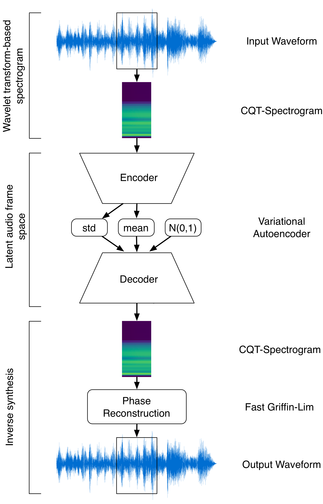

<small> K. Tatar, D. Bisig, and P. Pasquier, “Latent Timbre Synthesis,” Neural Computing & Applications, Oct. 2020, doi: 10.1007/s00521-020-05424-2.
</small>

---

#### Latent Timbre Synthesis

Interpolations in the latent space of the VAE

---

#### Latent Timbre Synthesis

<small>https://www.youtube.com/watch?v=-1XuXbX_VZo</small>

<iframe width="800" height="450" src="https://www.youtube.com/embed/-1XuXbX_VZo?si=g7sQkcHFoc94XCwM" title="YouTube video player" frameborder="0" allow="accelerometer; autoplay; clipboard-write; encrypted-media; gyroscope; picture-in-picture; web-share" referrerpolicy="strict-origin-when-cross-origin" allowfullscreen></iframe>

---

# <!--fit-->Deep Generative Modelling is not neutral.

---

#### Latent Timbre Synthesis

Notes on Reproducibility

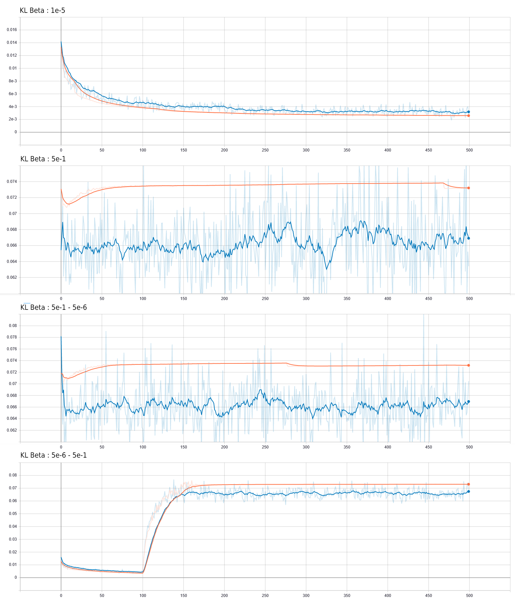

---

#### Latent Timbre Synthesis

Notes on Reproducibility

---

# <!--fit-->Most Musical AI research are ad-hoc efforts. 

---

#### Latent Timbre Synthesis

Emerging themes from the user study with 9 composers: 

- Iterative sound design in musical composition
- Musical strategies
- Musical goals and concepts
- Familiarity
- Affordances
- Sound aesthetics
- Sound quality
- User Inteface
- Tool Deficiencies
- Continued use

---

### Deep Learning and Audio

- Latent Timbre Synthesis
- **Coding the Latent Artwork and RawAudio Variational Autoencoder**
- Neuralacoustics
- Music Notation and Composition with Latent Spaces

---

#### Coding the Latent Artwork and RawAudio Variational Autoencoder 

<iframe width="800" height="450" src="https://www.youtube.com/embed/rfq82eKE-34?si=b3xsvPWKXwDRp12e&amp;start=2810" title="YouTube video player" frameborder="0" allow="accelerometer; autoplay; clipboard-write; encrypted-media; gyroscope; picture-in-picture; web-share" referrerpolicy="strict-origin-when-cross-origin" allowfullscreen></iframe>

---

#### RawAudio Variational Autoencoder

<small> K. Tatar, K. Cotton, and D. Bisig, “Sound Design Strategies for Latent Audio Space Explorations Using Deep Learning Architectures,” presented at the Proceedings of Sound and Music Computing 2023, 2023.</small>

---

#### RawAudio Variational Autoencoder

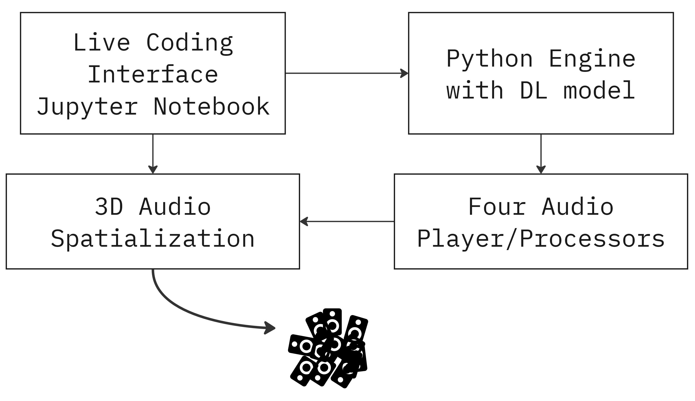

---

#### Coding the Latent

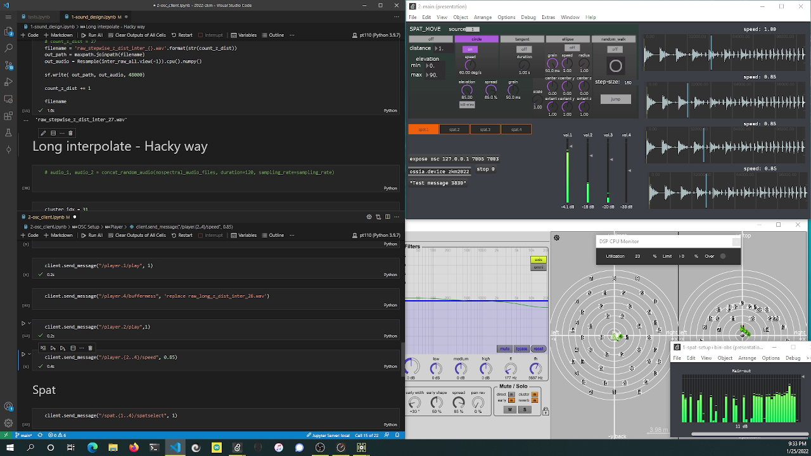
    
---

### Deep Learning and Audio

- Latent Timbre Synthesis
- Coding the Latent Artwork and RawAudio Variational Autoencoder
- **Neuralacoustics**
- Music Notation and Composition with Latent Spaces

---

#### Neuralacoustics

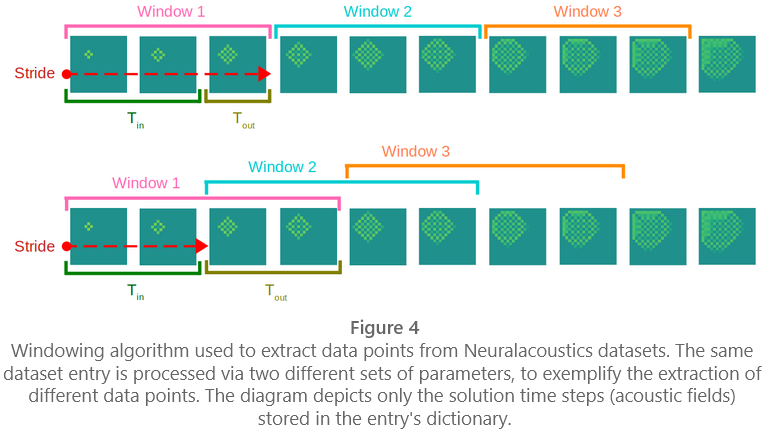

<small>Chen, J., Tatar, K., & Zappi, V.. (2024). A Deep Learning Framework for Musical Acoustics Simulations. In Proceedings of the AI Music Creativity Conference. Oxford, London, September 2024. https://aimc2024.pubpub.org/pub/5cl1cvmy/release/1</small>

---

#### Neuralacoustics

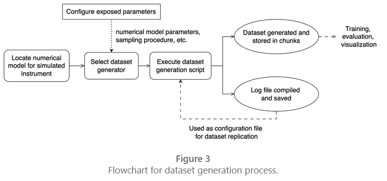

---

#### Neuralacoustics

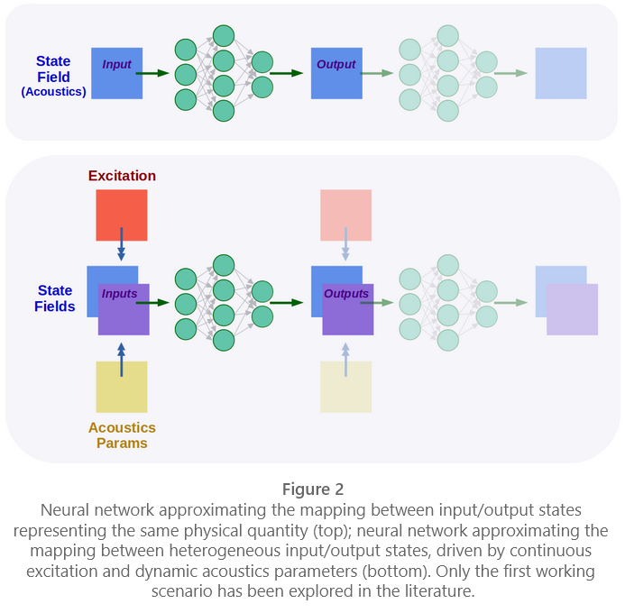

---

### Deep Learning and Audio

- Latent Timbre Synthesis
- Coding the Latent Artwork and RawAudio Variational Autoencoder
- Neuralacoustics
- **Music Notation and Composition with Latent Spaces**

---

#### Music Notation and Composition with Latent Spaces

**Meta-Benjolin**

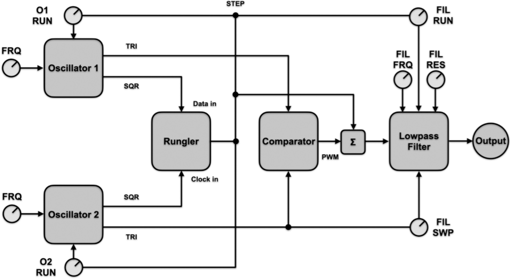

 
 
 
 
 
 
 
 

<small>Madaghiele V., Lund L., Holzer D., Kelkar T., Tatar, K., and Holzapfel A. (2026). Expanding the machine: notating generative synthesis with a state-based representation and an interactive timbre space. Organised Sound, Cambridge Press.</small>

---

#### Music Notation and Composition with Latent Spaces

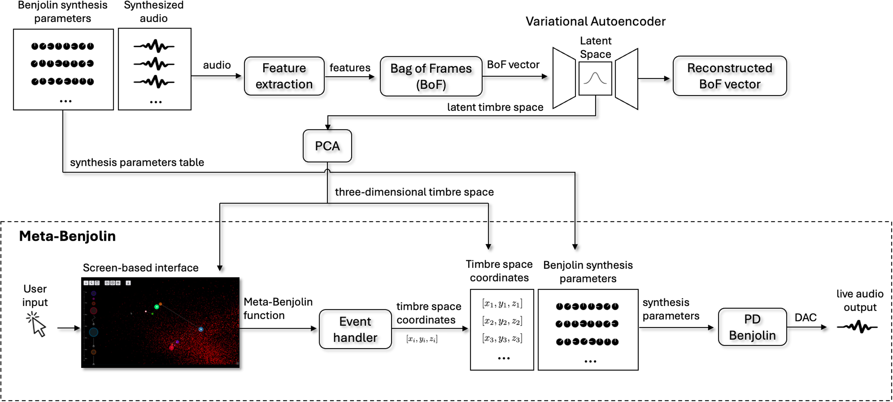

---

#### Music Notation and Composition with Latent Spaces

---

#### Music Notation and Composition with Latent Spaces

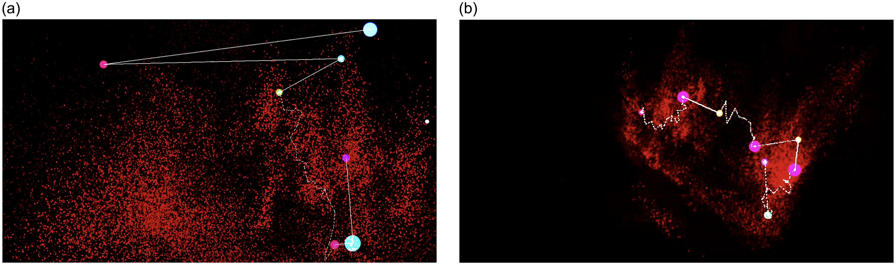

<small>Examples of the use of transitions to navigate long distances. D2 used a meander transition in the middle of the piece to connect two sections; within a section, neighbouring states are connected using crossfades. A5 used a crossfade and a meander transition to navigate between two neighbourhoods in the cloud, each corresponding to a section in their piece. (a) Composition by D2 (detail), Sound_example_4.m4a in the sound material. (b) Composition by A5 (detail), Sound_example_5.m4a in the sound material.
</small>

---

#### Music Notation and Composition with Latent Spaces

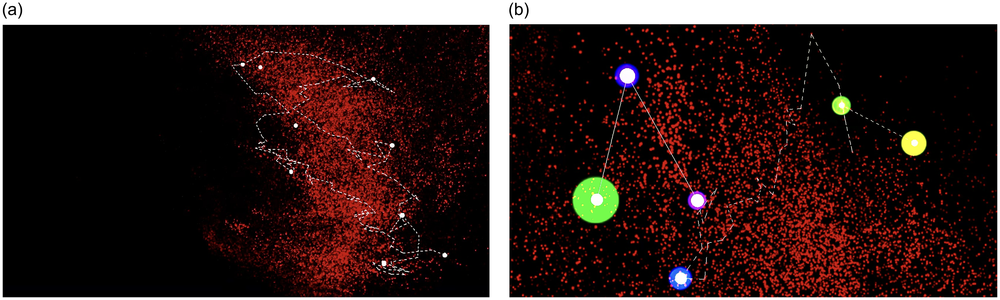

<small>The space distribution of these two compositions gives information about how the sound evolves in time. While composer D3 created a gradual and constant evolution by navigating the whole point cloud using the meander transition, B3 was interested in exploring local variations and nuances. This difference can be seen by the fact that the viewpoint is zoomed far out in (a), while it is much closer to the cloud in (b).</small>

---

#### Music Notation and Composition with Latent Spaces

  <iframe
    src="https://meta-benjolin.com/"
    title="AI Dungeon"
    style="
      position: absolute;
      inset: 0;
      width: 100%;
      height: 100%;
      border: 0;
    "
    loading="lazy"
    referrerpolicy="no-referrer-when-downgrade"
    allowfullscreen
  ></iframe>

<small>Madaghiele V., Lund L., Holzer D., Kelkar T., Tatar, K., and Holzapfel A. (2026). Expanding the machine: notating generative synthesis with a state-based representation and an interactive timbre space. Organised Sound, Cambridge Press.</small>

---

## Research Themes

- Deep Learning and Audio
- **Multimodal Deep Learning for Movement and Audio**
- AI in Computational Creativity and Game Design
- Societal Impact of AI in Culture, Arts, and Music

---

### Multimodal Deep Learning for Movement and Audio

- **Reinforcement Learning for Musical Performances with Moving Machines**
- Raw Music from Free Movements
- Neural Audio Instruments

---

#### Reinforcement Learning for Musical Performances with Moving Machines

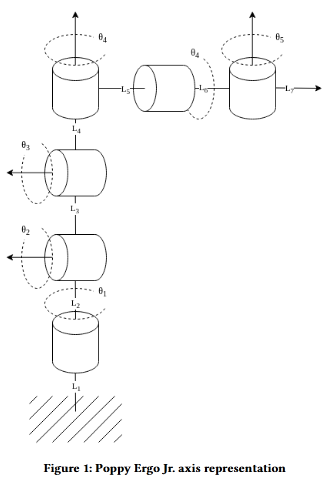

<small>Caravati, Matteo, Tatar, Kıvanç. (2024). Interfacing ErgoJr with Creative Coding Platforms. In Proceedings of the 9th International Conference on Movement and Computing. Utrecht, Netherlands, May 2024. https://dl.acm.org/doi/10.1145/3658852.3659082</small>

---

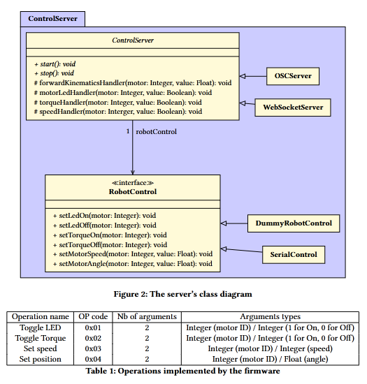

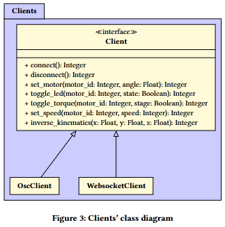

---

### Multimodal Deep Learning for Movement and Audio

- Reinforcement Learning for Musical Performances with Moving Machines
- **Raw Music from Free Movements**
- Neural Audio Instruments

---

#### Raw Music from Free Movements

<small>Bisig D., Tatar, K. (2021). Raw Music from Free Movements: Early Experiments in Using Machine Learning to Create Raw Audio from Dance Movements. In Proceedings of AI Music Creativity Conference 2021. Best Paper Award.</small>

---

#### Raw Music from Free Movements

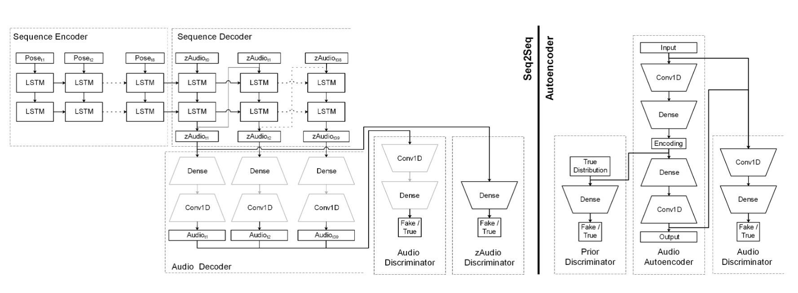

---

### Multimodal Deep Learning for Movement and Audio

- Reinforcement Learning for Musical Performances with Moving Machines
- Raw Music from Free Movements
- **Neural Audio Instruments**

---

#### Neural Audio Instruments

 

Neural Audio is a category of deep learning pipelines which output audio signals directly, in real-time scenarios of action-sound interactions

 

We define neural audio instruments as Digital Musical Instruments that embed neural network and deep learning approaches capable of directly generating or transforming audio signals, and enabling real-time action–sound mapping.

 
 
 
<small>Zappi, V., & Tatar, K. (2025). Neural audio instruments: Epistemological and phenomenological perspectives on musical embodiment of deep learning. Frontiers in Computer Science, 7. https://doi.org/10.3389/fcomp.2025.1575168 </small>

---

#### Neural Audio Instruments

 

The six takeaways from our conceptualization of neural audio instruments:

- Stand on the shoulders of giants
- Search for new modes of interaction
- Challenge dualities
- Embrace inexplicability (with a grain of salt)
- Make AI inconspicuous

 
 
 

<small>Neural audio instruments: Epistemological and phenomenological perspectives on musical embodiment of deep learning. Frontiers in Computer Science, 7. https://doi.org/10.3389/fcomp.2025.1575168</small>

---

**0.Stand on the shoulders of giants**

- All the core insights from the DMI literature remain relevant 
- Challenges like the control bottleneck and the symbolic nature of action-to-sound can become more pronounced under AI/ML conditions 
- Established guidance on fostering embodiment in DMIs still applies here as a vital starting point!

---

**1.Search for new modes of interaction.** 
   
- The behaviors and “materials” of any instrument strongly condition how musicians interact with it 
- Neural networks, however, may exhibit properties not easily paralleled in earlier instruments. 
- Novel paradigms, such as directly “traversing” multi-dimensional latent spaces, might offer fresh avenues for mapping movement and cognition to sonic outcomes

---

**2.Challenge dualities**

- A pressing and practical concern for DMIs lies in the traditional control–synthesis divide and the predicate of mapping. 
- We do not suggest abandoning mapping altogether; exploration of how gesture connects to sound is a valuable design tool. 
- We advocate a holistic design perspective where sound and gesture are conceived as a unified entity from the outset, rather than as two separate “containers” later bound by mapping 

---

**3.Embrace inexplicability (with a grain of salt).**
   
- While research on explainable AI is undoubtedly worthwhile, non-explainability can play a significant role in the use and design of neural audio instruments.
- Performers and even designers of neural audio systems may choose to focus on musical outcomes rather than dissecting every underlying process. 
- Indeed, not all instrument designs are “predicated on the application of scientific knowledge” (Green, 2011) and a certain measure of “unknowing” can inspire extraordinary results. 
- This notion also resonates with broader human-computer interaction discourse on the creative power of ignorance (Grammenos, 2014) (ranging from lack of preconceptions, to true ignorance), where “if you already know where you are going, you are not going someplace new.”

---

**4. Make AI inconspicuous.**

- When the AI is not intended to act as a distinct musical agent, making its presence explicit may be unnecessary or even counterproductive.
- Designers might treat neural audio models as just another invisible part of the instrument's anatomy, like the string of a piano or the integrated circuit of an analog synthesizer. 
- By letting the model manifest itself only through the embodiment of the musician's actions and intentions, the performer can experience a unified instrument rather than a model endowed with conspicuous (artificial) intelligence
- By rendering the model seamlessly integral, designers promote an experience of playing an instrument rather than interfacing with an AI model.

---

## Research Themes

- Deep Learning and Audio
- Multimodal Deep Learning for Movement and Audio
- **AI in Computational Creativity and Game Design**
- Societal Impact of AI in Culture, Arts, and Music

---

### AI in Computational Creativity and Game Design

- Towards Computationally Creative Game Design
- Grounding Machine Creativity in Game Design Knowledge Representations

---

### AI in Computational Creativity and Game Design

- Understanding Co-Storytelling with Large Language Models (LLMs)
- **Towards Computationally Creative Game Design**
- AEGIS: Authentic Edge Growth In Sparsity for Link Prediction
- Grounding Machine Creativity in Game Design Knowledge Representations

---

#### Towards Computationally Creative Game Design

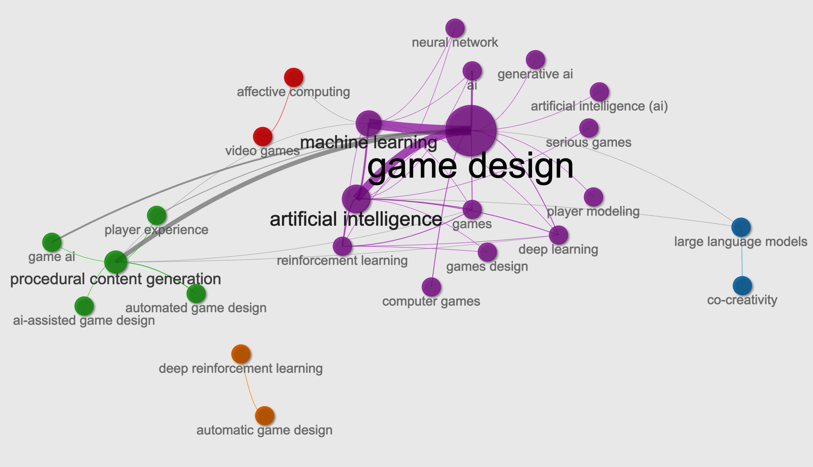

Reviewed 236 studies on learning-based AI in game design

While AI technologies are widely applied for functional and procedural tasks, **creativity remains underexplored**

We investigated the correlation between the appearance of creativity-related terms and their co-occurrence with other keywords. 

The co-occurrence network here visualizes the relationships and connections between frequently co-occurring keywords within the same article. 

<small>Liu, H. X., Cotton, K., Björk, S., Tatar, K. Towards Computationally Creative Game Design in Human-Computer Interaction: A Systematic Overview of Learning-based Artificial Intelligence in Game Design. Submitted to Games: Research and Practice.</small>

---

#### Previous work

Game Design Patterns (Bjork and Holopainen, 2005) includes 200 patterns.

  <iframe
    src="http://virt10.itu.chalmers.se/index.php/Category:Patterns"
    title="AI Dungeon"
    style="
      position: absolute;
      inset: 0;
      width: 100%;
      height: 100%;
      border: 0;
    "
    loading="lazy"
    referrerpolicy="no-referrer-when-downgrade"
    allowfullscreen
  ></iframe>

<small> <http://virt10.itu.chalmers.se/index.php/Category:Patterns> 
Bjork, S., and Holopainen, J. 2005. Patterns in game design, volume 11. Charles River Media Hingham. </small>

---

### AI in Computational Creativity and Game Design

- Understanding Co-Storytelling with Large Language Models (LLMs)
- Towards Computationally Creative Game Design
- AEGIS: Authentic Edge Growth In Sparsity for Link Prediction
- **Grounding Machine Creativity in Game Design Knowledge Representations**

---

#### LLM-Based Executable Synthesis of Goal Playable Game Design Patterns

We investigated whether large language models can translate structured game‑design knowledge—specifically goal‑pattern  abstractions—into executable Unity game scenes

**Game Development Framing:** Digital game development as a computational creativity activity, in which design‑pattern abstractions and game engine constraints guide the creation of an executable, playable game
**Execution‑grounded evaluation pipeline:** An end‑to‑end workflow (LLM generation → Unity batch compilation → log‑based failure analysis) for assessing executable viability at scale.
**Insights on human–machine knowledge boundaries:** Game design pattern knowledge injection increases structural complexity requirement at generation, revealing a tension in how domain knowledge should be injected into generative systems.

---

<!-- _class: columns -->

#### Grounding Machine Creativity in Game Design Knowledge Representations

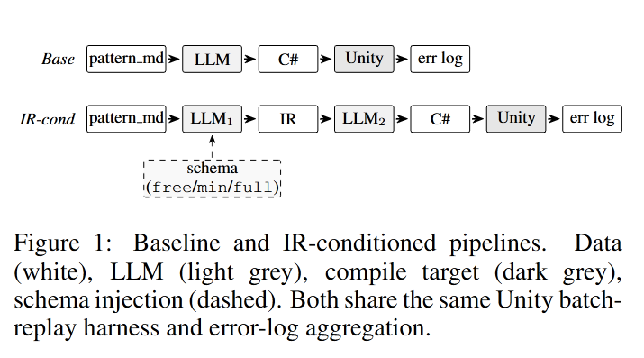

<small>Liu, H. X., & Tatar, K. (2026). Grounding Machine Creativity in Game Design Knowledge Representations: Empirical Probing of LLM-Based Executable Synthesis of Goal Playable Patterns under Structural Constraints. [arXiv preprint arXiv:2603.07101.](https://arxiv.org/abs/2603.07101) </small>

#### Mage: Multi-Axis Evaluation of LLM-Generated Executable Game Scenes Beyond Compile-Pass Rate

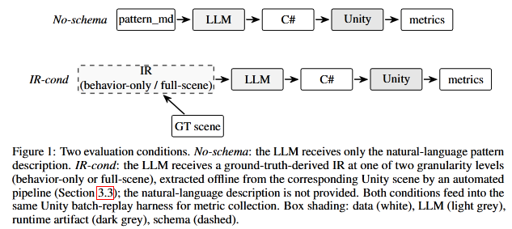

<small>Liu, H. X., & Tatar, K. (2026). Mage: Multi-Axis Evaluation of LLM-Generated Executable Game Scenes Beyond Compile-Pass Rate. Submitted to NeurIPS 2026. [arXiv preprint arXiv:2605.07342.](https://arxiv.org/abs/2605.07342)</small>

---

#### Mage: Multi-Axis Evaluation of LLM-Generated Executable Game Scenes Beyond Compile-Pass Rate

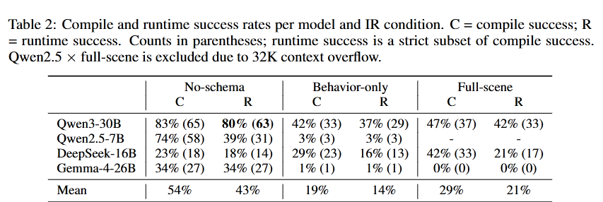

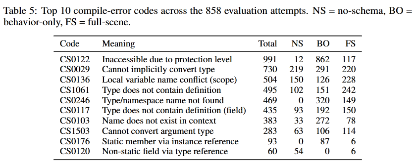

---

### AI in Computational Creativity and Game Design

- Compile rate alone as a misleading evaluation signal.

- A three-factor interpretation, anchored in the error taxonomy. 
1- **Domain Completeness:** what information the intermediate representation carries
2- **API-mapping adequacy:** whether the prompt translates intermediate representation entity names into valid Unity API calls.
3- **LLM execution fidelity:** whether the model uses the information correctly

Any LLM code-generation task targeting a domain-specific framework faces these three factors.

---

## Research Themes

- Deep Learning and Audio
- Multimodal Deep Learning for Movement and Audio
- AI in Computational Creativity and Game Design
- **Societal Impact of AI in Culture, Arts, and Music**
- Artworks

---

### Societal Impact of AI in Culture, Arts, and Music

- **A Shift in Artistic Practices through Artificial Intelligence**
- Caring Trouble and Musical AI
- Bringing the Body Back to AI Voice and Speech Technologies

---

#### A Shift in Artistic Practices through Artificial Intelligence 

<small>K. Tatar et al., “A Shift in Artistic Practices through Artificial Intelligence,” Leonardo, pp. 293–297, Apr. 2024, doi: 10.1162/leon_a_02523.</small>

---

### Societal Impact of AI in Culture, Arts, and Music

- A Shift in Artistic Practices through Artificial Intelligence
- **Caring Trouble and Musical AI**
- Bringing the Body Back to AI Voice and Speech Technologies

---

#### Caring Trouble and Musical AI

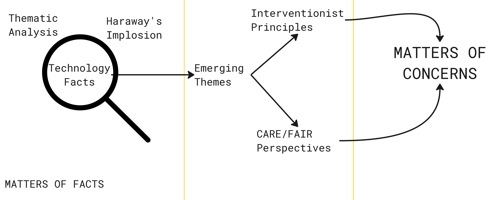

---

#### Caring Trouble and Musical AI

<small>Haraway, D. (2013). A cyborg manifesto: Science, technology, and socialist-feminism in the late twentieth century. In The transgender studies reader (pp. 103–118). Routledge.</small>

---

### Societal Impact of AI in Culture, Arts, and Music

- A Shift in Artistic Practices through Artificial Intelligence
- Caring Trouble and Musical AI
- **Bringing the Body Back to AI Voice and Speech Technologies**

---

#### Bringing the Body Back to AI Voice and Speech Technologies

Susan Bennett and Jon Briggs provided voice recordings for GM Voices, which were later licensed to ScanSoft.

Their voice datasets were then later allegedly used to build the voice
of the American Siri (Bennett) and British Siri (Briggs) through speech concatenation.

Apple has never confirmed, nor denied whether they utilised Bennett’s concatenated speech data, nor Briggs’. In the case of Bennett, audio forensics expert Ed Primeau studied recordings of Siri and blind recordings of Bennett’s voice and presented his the conclusion of his analysis that “They are identical – a 100 % match.”

<small>Cotton, Kelsey, de Vries, Katja & Tatar, Kıvanç. (2024). Singing for the Missing: Bringing the Body Back to AI Voice and Speech Technologies. In Proceedings of the 9th International Conference on Movement and Computing. Utrecht, Netherlands, May 2024. https://dl.acm.org/doi/10.1145/3658852.3659065</small>

---

#### Bringing the Body Back to AI Voice and Speech Technologies

- Integrating voice rights into personality rights frameworks
- The data frameworks for voice should be designed to have direct connection to their source body
- Similarity should be revisited, where nations take their own stances through democratic processes

---

#### ARIA: A Diagnostic Framework for Music Training Data Attribution

Two structural limits of data attribution in music generation: 

1- Counterfactual retraining at the scale of musical audio generation models is computationally infeasible since per-aspect ground truth is hard to construct
2- single scalar cannot support such evidence under the courts’ idea-expression distinction, since music similarity is multidimensional.

These limits matter because, with music copyright lawsuits actively underway, attribution evidence linking model outputs to specific training data has become increasingly important.

<small>Han, C., Panahi, A., & Tatar, K. (2026). ARIA: A Diagnostic Framework for Music Training Data Attribution. Submitted to NeurIPS 2026. https://arxiv.org/pdf/2605.16181 </small>

---

<!-- _class: columns -->

#### Case 1: Text-to-Audio Generation with Open-MusicLM

MusicLM-style three-stage hierarchical musical audio generation model trained on FMA-Large. The hierarchical structure provides three independently attributable stages: semantic, coarse, and fine; each predicting a different token type from a different audio segment duration, which allows us to measure whether each stage’s attribution recovers a different musical aspect.

#### Case 2: Symbolic Music Generation with MusicTransformer

A pre-trained MusicTransformer on MAESTRO with an Linear Datamodeling Score (LDS) attribution as theground truth, run four attribution evaluation methods: TRAK (10-ensemble), TracIn , GRAD-COS, and GradDot; through the ARIA's evaluation pipeline, obtaining score matrixes. We use the five jSymbolic 2.2 channels (melody, harmony, rhythm, dynamic, texture), extracted per training segment from the decoded MIDI.

---

<!-- _class: columns -->

#### Case 1: Text-to-Audio Generation with Open-MusicLM

Applying ARIA to a MusicLM-style musical audio generation model, embedding retrieval baselines diverge along the lines of each encoder’s pretraining objective, indicating that they report what the encoder represents rather than the influence of training data on the generative model.

#### Case 2: Symbolic Music Generation with MusicTransformer

All four reliability diagnostics rank attribution methods identically to LDS, supporting their use as a substitute signal where LDS is intractable.

---

### Artworks

- Expert Procrastinator's Tool: Artificial Intelligence (2023)
- Conceptual Pillars of Artistic Creativity
- Digital Ripples (2020)
- Experiments with VQGAN Text-to-Image Synthesis
- Exposing the Bias in Artificial Intelligence: The Cyber Future
- Exposing the Bias in Artificial Intelligence: The Machine Lexicon

---

#### Expert Procrastinator's Tool: Artificial Intelligence (2023)
<small>https://www.youtube.com/watch?v=xdf1uKzGYfs</small>

<iframe width="560" height="315" src="https://www.youtube.com/embed/xdf1uKzGYfs?si=2ffM-WlVKZgfJasB" title="YouTube video player" frameborder="0" allow="accelerometer; autoplay; clipboard-write; encrypted-media; gyroscope; picture-in-picture; web-share" referrerpolicy="strict-origin-when-cross-origin" allowfullscreen></iframe>

---

#### Digital Ripples (2020)

  <iframe
    src="https://objkt.com/tokens/hicetnunc/726715"
    title="AI Dungeon"
    style="
      position: absolute;
      inset: 0;
      width: 100%;
      height: 100%;
      border: 0;
    "
    loading="lazy"
    referrerpolicy="no-referrer-when-downgrade"
    allowfullscreen
  ></iframe>

---

#### Experiments with VQGAN Text-to-Image Synthesis

<video controls src="best-to-worst.mp4" width="450"></video>

---

#### Exposing the Bias in Artificial Intelligence: The Cyber Future
<small>https://www.youtube.com/watch?v=79gJtoeOhHE&source_ve_path=MTc4NDI0</small>

<iframe width="560" height="315" src="https://www.youtube.com/embed/79gJtoeOhHE?si=dHgWsZPMWFxTO_kt" title="YouTube video player" frameborder="0" allow="accelerometer; autoplay; clipboard-write; encrypted-media; gyroscope; picture-in-picture; web-share" referrerpolicy="strict-origin-when-cross-origin" allowfullscreen></iframe>

---

#### Exposing the Bias in Artificial Intelligence: The Machine Lexicon
<small>https://www.youtube.com/watch?v=RhOfPQJSrok&source_ve_path=MTc4NDI0</small>

<iframe width="560" height="315" src="https://www.youtube.com/embed/RhOfPQJSrok?si=oXLhS4DY-nMmvASS" title="YouTube video player" frameborder="0" allow="accelerometer; autoplay; clipboard-write; encrypted-media; gyroscope; picture-in-picture; web-share" referrerpolicy="strict-origin-when-cross-origin" allowfullscreen></iframe>
 
---

#### Exposing the Bias in Artificial Intelligence: The Digital Assemblage

---

## Research Themes

- Deep Learning and Audio
- Multimodal Deep Learning for Movement and Audio
- AI in Computational Creativity and Game Design
- Societal Impact of AI in Culture, Arts, and Music
- Artworks

---

<!-- _class: columns -->

## Key Takeaways

- Most musical AI research are often ad-hoc efforts.
- NIME and DMI research still carry on the lineages of HCI. Music and arts research need its own lineage.
- Technology is not neutral, it is situated in social and cultural contexts. 
- It is time for artists and musicians to take on and lead the musical AI technology development.

## Future is Bright!

- Mathematics of Latent Audio Spaces
- Establishing methods and frameworks for joint efforts in musical AI research
- Moving machines as musical agents
- Creativity beyond the material
- New mixed research methods for analyzing demographic representations in generative AI

---
# Thank you! 

Feel free to reach out -> tatar@chalmers.se
